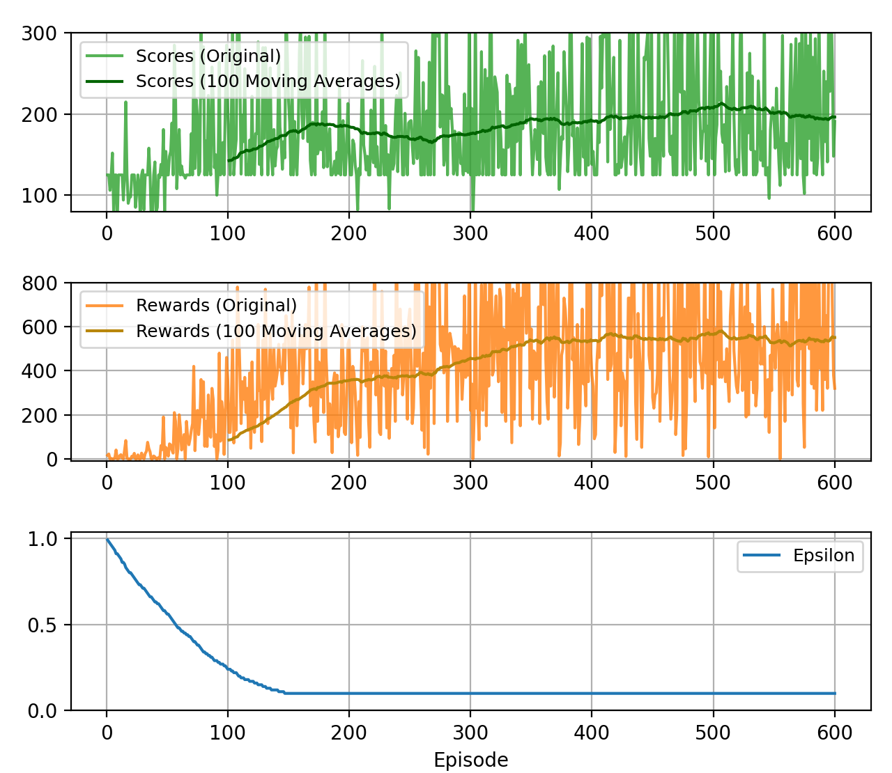
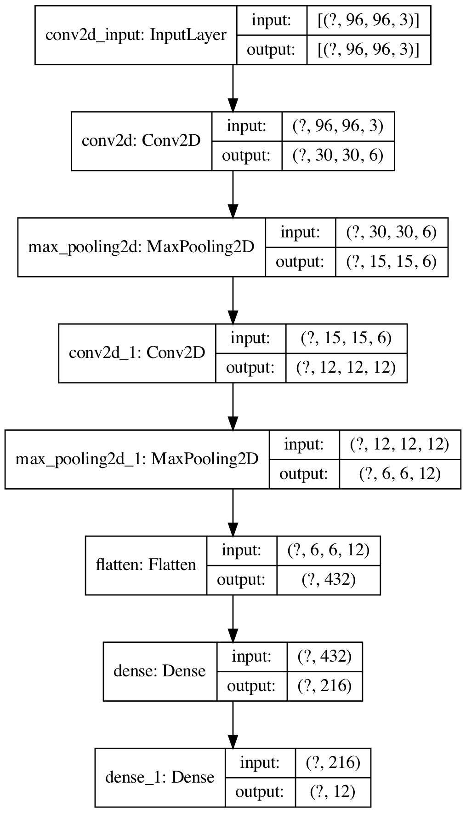

# OpenAI GYM CarRacing DQN

Training machines to play CarRacing 2d from OpenAI GYM by implementing Deep Q Learning/Deep Q Network(DQN) with TensorFlow and Keras as the backend.

### Training Results
We can see that the scores(time frames elapsed) stop rising after around 500 episodes as well as the rewards. Thus let's terminate the training and evaluate the model using the last three saved weight files `trial_400.h5`, `trial_500.h5`, and `trial_600.h5`.
<br>


#### Training After 400 Episodes
The model knows it should follow the track to acquire rewards after training 400 episodes, and it also knows how to take short cuts. However, making a sharp right turn still seems difficult to it, which results in getting stuck out of the track.
<br>


#### Training After 500 Episodes
The model can now drive faster and smoother after training 500 episodes with making seldom mistakes.
<br>


#### Training After 600 Episodes
To acquire more rewards greedily, the model has gone bad that learns how to drive recklessly and thus making it going off the track when reaching sharp turns.
<br>


## Usage

### Keyboard Agent
To play the game with your keyboard, execute the following command.
```
python play_car_racing_with_keyboard.py
```
- Control the steering wheel by using the `left` and `right` key.
- Control the gas by using the `space` key.
- Control the break by using the `shift` key.

### Train the Deep Q Network(DQN)
```
python train_model.py [-m save/trial_XXX.h5] [-s 1] [-e 1000] [-p 1.0]
```
- `-m` The path to the trained model if you wish to continue training after it.
- `-s` The starting training episode, default to 1.
- `-e` The ending training episode, default to 1000.
- `-p` The starting epsilon of the agent, default to 1.0.

### DQN Agent
After having the DQN model trained, let's see how well did the model learned about playing CarRacing.
```
python play_car_racing_by_the_model.py -m save/trial_XXX.h5 [-e 1]
```
- `-m` The path to the trained model.
- `-e` The number of episodes should the model play.

## File Structure

- `train_model.py` The training program.
- `common_functions.py` Some functions that will be used in multiple programs will be put in here.
- `CarRacingDQNAgent.py` The core DQN class. Anything related to the model is placed in here.
- `play_car_racing_by_the_model.py` The program for playing CarRacing by the model.
- `play_car_racing_with_keyboard.py` The program for playing CarRacing with the keyboard.
- `save/` The default folder to save the trained model.

## Details Explained
Deep Q Learning/Deep Q Network(DQN) is just a variation of Q Learning. It makes the neural network act like the Q table in Q Learning thus avoiding creating an unrealistic huge Q table containing Q values for every state and action.

### Q Value
Q value is the expected rewards given by taking the specific action during the specific state.
In a more mathematical saying, Q value can be written as:

> Q(s,a) = r(s,a) + γ(maxQ(s',A))

- `s` is the current state
- `s'` is the next future state
- `a` is the particular action
- `A` is the action space
- `Q(s,a)` is the Q value given by taking the action `a` during the state `s`
- `r(s,a)` is the rewards given by taking the action `a` during the state `s`
- `maxQ(s',A)` is the maximum Q value given by taking any action in the action space `A` during the state `s'`
- `γ` is the discount rate that will discount the future Q value because the future Q value is less important

The Q value given the state `s` and the action `a` is the sum of the rewards given the state `s` and the action `a` and the maximum Q value given any action in the action space and the next state `s'` multiplied by the discount rate.

Therefore, we should always choose the action with the highest Q value to maximize our rewards.

### The DQN Structure
The Deep Q Network(DQN) takes 3 consecutive top views of the current state of the 2d car racing game as the input and outputs the Q value for each action.
- Note that the input shape is 96x96x3. The last dimension "3" doesn't mean "RGB" in colors but the 3 consecutive top views of the current state(96x96). The top view image has only one dimension because it is a grayscale image. Color doesn't matter much in this game, so we take advantage of the original color dimension by storing the top view image stack.
- Convolutional layers are used for capturing features from the image.
- Max pooling layers are used for preserving important features meanwhile discarding unnecessary information from the network in order to keep the network small.
- Dense layers are the other terms for fully connected layers in Keras.
- The output shape represents the Q value of the 12 actions. These actions are: 3 states of the steering wheel(left, straight, right), 2 states of the gas(full gas, release gas), and 2 states of the break(giving 20% break, release break).
- The `?` dimension is used for batch input.
<br>


### How Self-Driving Works
- During the game, the program will stack the latest 3 states of 96x96 pixels grayscale images and feed them to the trained model.
- The model produces the Q values for the 12 actions.
- Choose the action that has the highest Q value for the agent to perform.
- As long as the model is well trained, the action that has the highest Q value should be the best action(could obtain the most rewards) that the agent should react to the environment.
- Repeat the steps above so that the car is now self-driving:)

